# Ultimate fully customizable swatches holder generator

This is an [OpenSCAD](https://openscad.org/) script to generate filament and infill swatches tiles holder. Holders generated with the default settings are fully compatible with [Bambu Lab sample swatches](https://us.store.bambulab.com/products/bambu-filament-swatches) , swatches generated by my other project [Ultimate fully customizable swatches generator](https://github.com/zizzo81/swatches) and are the full compatible parametrization of the [Swatch Display Board by Bambu Lab](https://makerworld.com/en/models/14863#profileId-14645), **any** parameter of the swatches and holder can be changed.

This script has been published and can be found and used directly on [MakerWorld](https://makerworld.com/en)'s [page](https://makerworld.com/en/models/488028).

 

## Summary

- [A guide through the tabs of parameters](#a-guide-through-the-tabs-of-parameters)
  - [Dimensions](#dimensions)
  - [Sides](#sides)
    - [Top side](#top-side)
    - [Left side](#left-side)
    - [Right side](#right-side)
    - [Bottom side](#bottom-side)
  - [3D printing settings](#3d-printing-settings)
- [What you can create](#what-you-can-create)
  - [Monochromatic holders](#monochromatic-holders)
  - [Multi color holders on mono printers or for non AMS compatible filaments (using pause at layer/height)](#multi-color-holders-on-mono-printers-or-for-non-ams-compatible-filaments-using-pause-at-layerheight)
  - [Multi color holders on multi color printers](#multi-color-holders-on-multi-color-printers)
- [Version history](#version-history)
- [Thanks](#thanks)

## A guide through the tabs of parameters

Here's an detailed explanation of every possible setting. Feel free to explore the endless possibilities of combining these values.

### Dimensions

In this tab you can customize the dimension of every aspect of this design.

| Parameter              | Description                                                  | unit | min  | max  | default |
| ---------------------- | ------------------------------------------------------------ | ---- | ---- | ---- | ------- |
| columns                | The number of tiles for each row.                            | n.   | 1    | 10   | 4       |
| rows                   | The number of tiles for each column.                         | n.   | 1    | 15   | 5       |
| columns_spacer         | The distance of the raised border between columns.           | mm   | 0.1  | 25   | 5       |
| rows_spacer            | The distance of the raised border between rows.              | mm   | 0.1  | 25   | 5       |
| outside_border         | The dimension of the border all around the holder.           | mm   | 0.1  | 25   | 2.2     |
| tile_size              | Being the tile a rounded-corners square, this defines the length of the side of that square. | mm   | 10   | 100  | 24.1    |
| tile_height            | This is the tile depth.                                      | mm   | 1    | 5    | 2.15    |
| tile_radius            | This sets the roundness of the above mentioned square.       | mm   | 1    | 10   | 3.1     |
| outside_border_chamfer | This is the chamfer applied to the external border at top. (0 = no chamfer) | mm   | 0    | 10   | 0.5     |
| outside_border_radius  | The radius of the corners in the external border. (0 = squared borders) | mm   | 0    | 10   | 5       |
| back_height            | The height of the back part of the grid (the one below the tiles). | mm   | 0.4  | 10   | 1.35    |
| create_back_hole       | If a hole in the back back, at the middle of each tile must be cut. This hole allows to easily extract a tile by placing a finger behind it and pushing forward. | bool |      |      | true    |
| back_hole_diameter     | The diameter of the back hole above mentioned.               | mm   | 2    | 25   | 15.5    |
| back_hole_chamfer      | Specifies if a chamfer must be cut around the bottom border of the back hole. (0 = no chamfer) | mm   | 0    | 1    | 0.4     |
| create_pin             | This sets if a holding pin must be created for each tile.    | bool |      |      | true    |
| pin_diameter           | Diameter of the pin to be created.                           | mm   | 1    | 5    | 3.1     |
| pin_x_offset           | X-axis distance from the left border of a tile to the center of the pin. | mm   | 1    | 10   | 3.9     |
| pin_y_offset           | Y-axis distance from the top border of a tile to the center of the pin. | mm   | 1    | 10   | 4.6     |
| pin_chamfer            | Specifies if a chamfer must be created around the top border of the pin. (0 = no chamfer) | mm   | 0    | 1    | 0.1     |

### Sides

All the sides have the same settings available or better to say, horizontal sides (top and bottom) have the same settings, vertical sides (left and right) have the same settings. In these sections you can enable the creation of an expanded border with a text and one/two/no holes for using a collector.

#### Top side

| Parameter               | Description                                                  | unit | min  | max  | default          |
| ----------------------- | ------------------------------------------------------------ | ---- | ---- | ---- | ---------------- |
| top_create              | Indicates if a expanded border must be created on this side. | bool |      |      | true             |
| top_dimension           | Specified the dimension (height) of this side.               | mm   | 3    | 50   | 10               |
| top_text                | Specifies the text to create on this side. (leave this field blank to have no text) | text |      |      | “Top text”       |
| top_direction           | The direction on Z-axis where the text extends, allows these values: - **Extrude** - **Chisel** |      |      |      | Chisel           |
| top_height              | The height in millimeters of extrusion or chisel.            | mm   | 0.1  | 5    | 0.4              |
| top_font                | Choose one of the supported fonts from the list to apply it to the text on this side. |      |      |      | Liberation Serif |
| top_custom_font         | Here you can override the above setting by putting the name of a font installed in the system where this script is executed. Please keep in mind that when you use Parametric Model Maker, the system the script is running on is MakerWorld's server, not your computer. |      |      |      | *none*           |
| top_style               | Choose the style of the text. **Note:** not all fonts support all styles. |      |      |      | Bold             |
| top_size                | The size of the text.                                        | pt   | 1    | 12   | 5                |
| top_align               | Alignments of the text, accepted values: - **Left** - **Center** - **Right** |      |      |      | Center           |
| top_spacing             | Spacing between letters, the greater the number, the far the letters are. |      | 0.1  | 5    | 1                |
| top_x_offset            | X offset of the text to compensate and correct calculated position. | mm   | -100 | 100  | 0                |
| top_y_offset            | Y offset of the text to compensate and correct calculated position. | mm   | -100 | 100  | 0                |
| top_holes               | Create holes in this, this value can be: - **None** - no holes are cut; - **Left** - only a hole on the left side is created; - **Right** - only a hole on the right side is created; - **Both** - two holes are created, one on the left and one on the right side. |      |      |      | None             |
| top_holes_diameter      | The diameter of the holes.                                   | mm   | 0.2  | 10   | 5                |
| top_holes_distance      | The distance from the side of the border to the middle of the hole. | mm   | 0.2  | 100  | 3                |
| top_left_hole_x_offset  | An offset on the X-axis to give to the left hole.            | mm   | -100 | 100  | 0                |
| top_left_hole_y_offset  | An offset on the Y-axis to give to the left hole.            | mm   | -100 | 100  | 0                |
| top_right_hole_x_offset | An offset on the X-axis to give to the right hole.           | mm   | -100 | 100  | 0                |
| top_right_hole_y_offset | An offset on the Y-axis to give to the right hole.           | mm   | -100 | 100  | 0                |

#### Left side

Left side has almost the same configuration as the top side, here only the differences will be shown.

| Parameter        | Description                                                  | unit | min  | max  | default            |
| ---------------- | ------------------------------------------------------------ | ---- | ---- | ---- | ------------------ |
| left_text        | Specifies the text to create on this side. (leave this field blank to have no text) | text |      |      | *empty*            |
| left_orientation | The orientation of the text, which can be: - **Rotated text (CCW)** - counter-clockwise rotated text; - **Rotated text (CW)** - clockwise rotated text; - **Vertical text** - letters are horizontal, one below the other |      |      |      | Rotated text (CCW) |
| left__align      | Alignments of the text, accepted values: - **Top** - **Center** - **Bottom** |      |      |      | Center             |
| left_holes       | Holes can be created: - **None** - no holes are created; - **Top** - only the top hole is created; - **Bottom** - only the bottom hole is created; - **Both** - both the top and bottom holes are created. |      |      |      | Both               |

#### Right side

Right side has the same configuration as left side, only parameters that change are shown here.

| Parameter    | Description                                                  | unit | min  | max  | default      |
| ------------ | ------------------------------------------------------------ | ---- | ---- | ---- | ------------ |
| right_create | Indicates if a expanded border must be created on this side. | bool |      |      | false        |
| right_text   | Specifies the text to create on this side. (leave this field blank to have no text) | text |      |      | “Right text” |

#### Bottom side

Bottom side has the same configuration as top side, only parameters that change are shown here.

| Parameter     | Description                                                  | unit | min  | max  | default       |
| ------------- | ------------------------------------------------------------ | ---- | ---- | ---- | ------------- |
| bottom_create | Indicates if a expanded border must be created on this side. | bool |      |      | false         |
| bottom_text   | Specifies the text to create on this side. (leave this field blank to have no text) | text |      |      | “Bottom text” |

### 3D printing settings

| Parameter      | Description                                                  | default       |
| -------------- | ------------------------------------------------------------ | ------------- |
| print_mode     | Switches between modes of generation. - **Monochromatic** - generates the full body with holder, chiseled and extruded texts. - **Holder only** - generates the body of the holder with chiseled texts, but not extruded texts which can be lately added with the next option. - **Texts only** - generates only chiseled and extruded texts, this can be used to create a multicolor object. | Monochromatic |
| curves_quality | Selects the quality of curves to be used when generating the model, the lowest the quality, the faster generation will take. You can work in Draft all the time for fast refresh, but you need to remember to switch back to Normal or something higher before exporting the model to be printed.  Possible values: - **Draft** - low quality, not suitable for printing; - **Printable draft** - not for production, yet printable; - **Normal**: normal quality, ready to print; - **High quality**: good quality for high resolution printers.  **Be warned:** Parametric Model Maker has a short timeout for script execution to avoid DDoS attacks, for this reason setting a quality too high could create a timeout error | Normal        |

## What you can create

### Monochromatic holders

The easiest one, nothing to say: create a holder the way you want it.

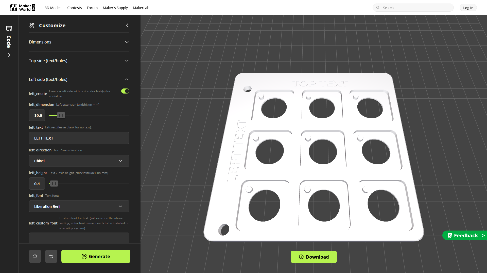An example holder to be printed using a single color.

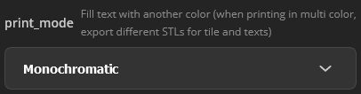

Make sure you selected **Monochromatic** for the parameter **print_mode** in the **3D printing settings** tab as shown in the image above.

Remember to left click on  to generate a version with your current settings.

Click on the  button to download the object to a file.

When this windows pops up, left click on the  button to select the .STL file format.

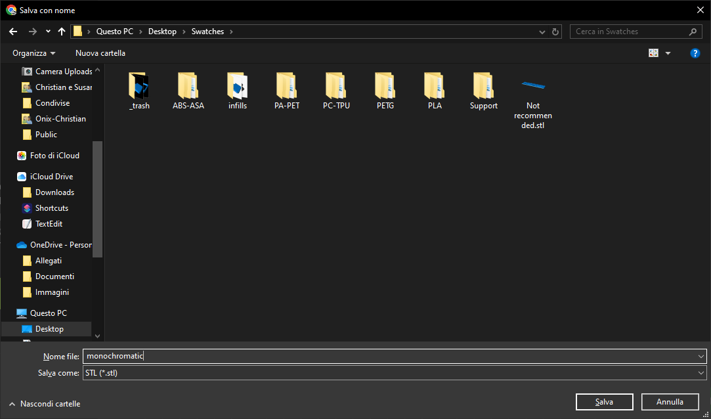

If your computer offers the possibility to save the file to a desired location, select a folder where you want to save it and choose a proper name, e. g. “monochromatic”, which fill create “monochromatic.stl”.

If your browser is configured to automatically save files, you will find the file named “Swatches holder.stl” in the location you usually receive downloaded file, usually called the “Downloads” folder.

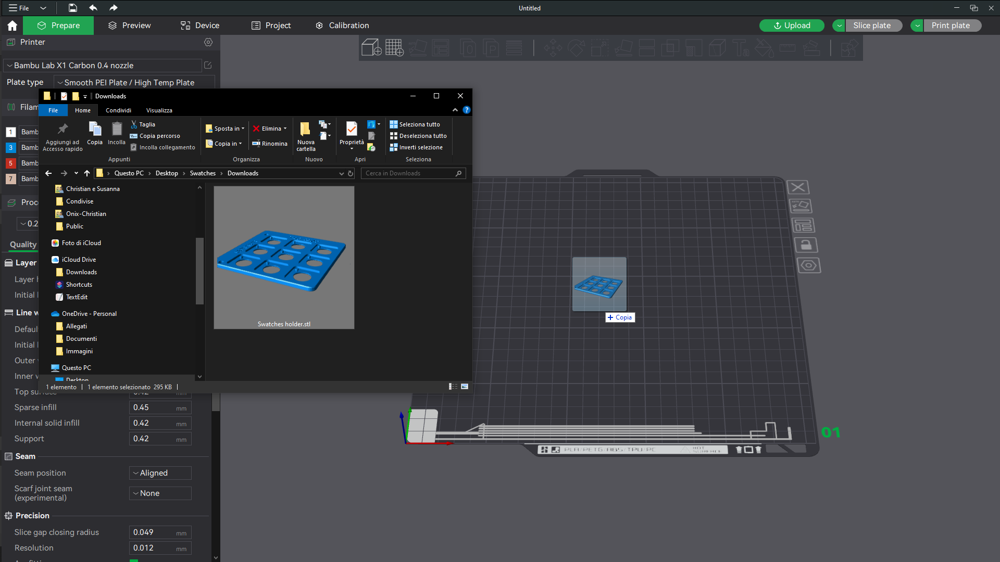
Open [Bambu Studio](https://bambulab.com/en/download/studio) or your preferred slicer, start a new project and drag the file onto it.

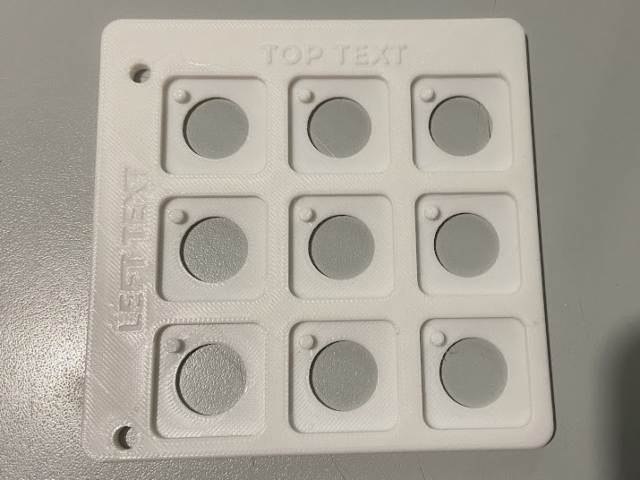

Sample result of the above operations.

### Multi color holders on mono printers or for non AMS compatible filaments (using pause at layer/height)

Please read the *Monochromatic holders* section for basic information about how to manage the whole process before continuing.

A limitation of the monochromatic printer can be partially bypassed, printing the texts with another color by using some clever tricks, here's how to do it.

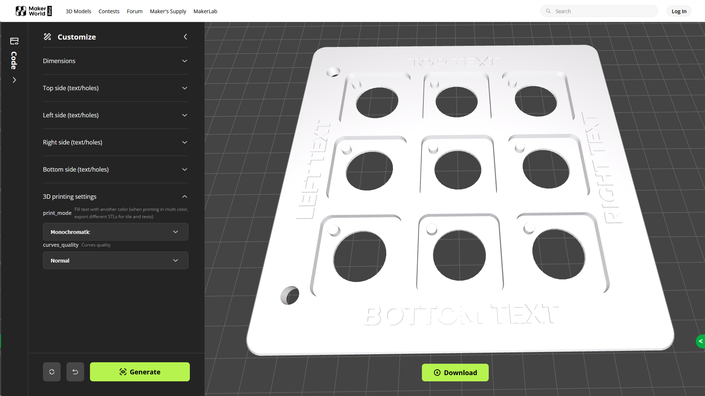
First of all make sure you designed your holder with all the texts as extruded, chiseled texts will not be colored.

Export it as STL and import into Bambu Studio following the same instructions for monochromatic printing until you reach the step where you slice it.

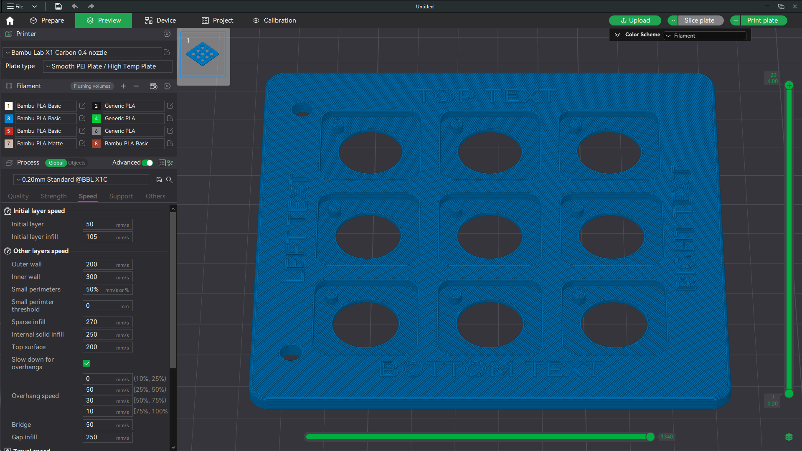
Once you sliced the plate, use drag the **+** icon of the vertical scrollbar down.

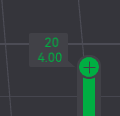

As you scroll top layers will disappear from view, continue scrolling down until only one layer with texts is visible.

Now, right click on the **+** icon and a menu will pop out.

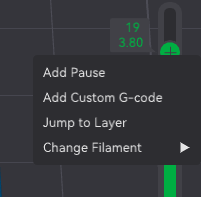

Select the **Add Pause** item, the you will have to slice the plate again.

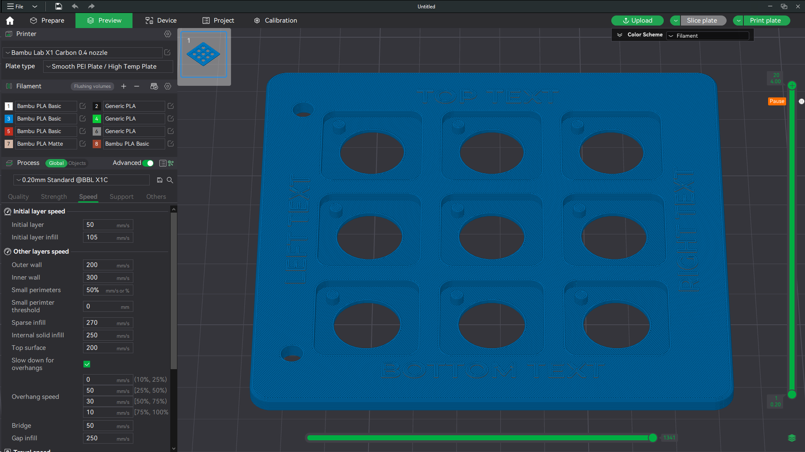

Once you sliced it again, the scrollbar will show a “Pause” label where you set it and the layer will be drawn with another color.

Now print this, when the printer is starting to print that layer, it will pause and the print head will be moved away from the piece and on the screen you will see a message.

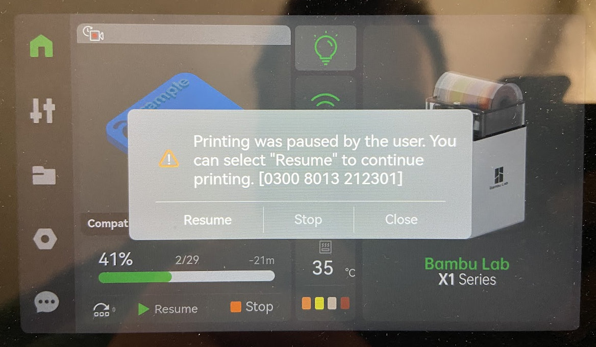

Change the filament in the printer, then press **Resume** to continue printing using the new color.

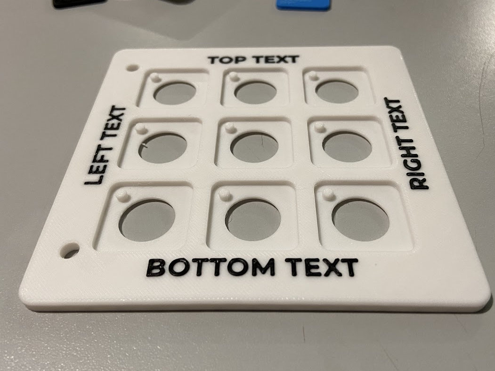

In my opinion, results are beautiful.

## Multi color holders on multi color printers

Please read the *Monochromatic holders* section for basic information about how to manage the whole process before continuing.

 

The most easy way to print these, yet the most satisfying way to customize this.

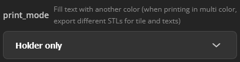

Once you draw your holder, be sure to select the **Holder only** option for the **print_mode** parameter in the **3D printing settings** tab and click on **Generate**.

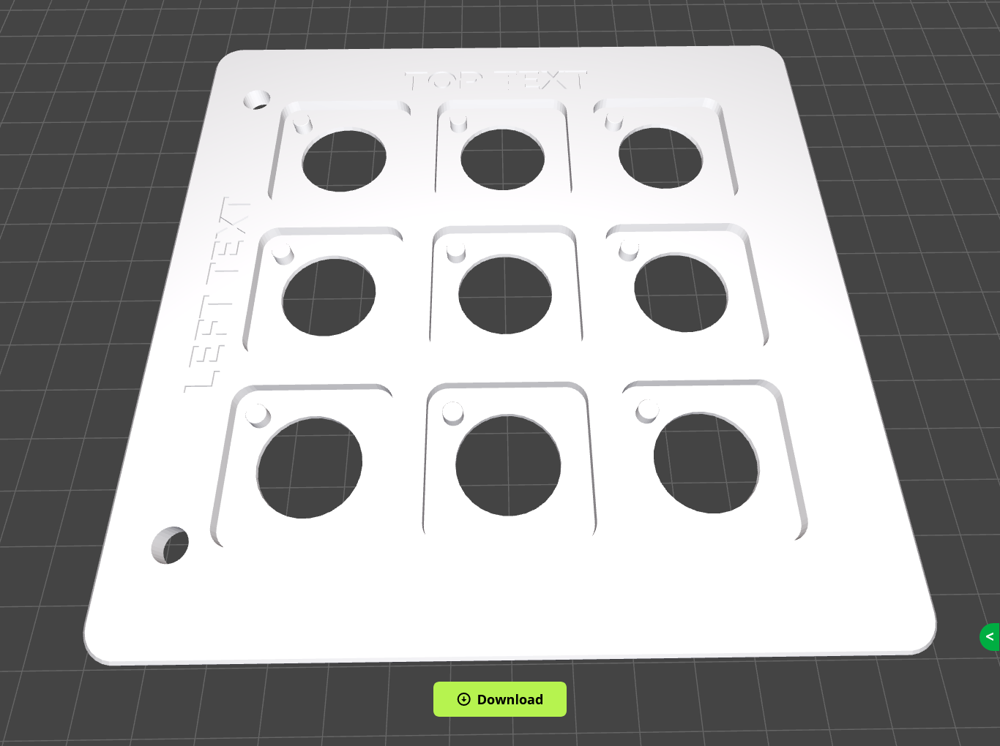
Click the **Download** button to export to a STL file, let's say holder.stl.

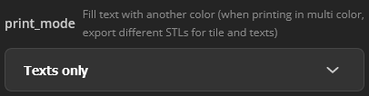

Change the **print_mode** parameter to **Texts only** and click **Generate** button again.

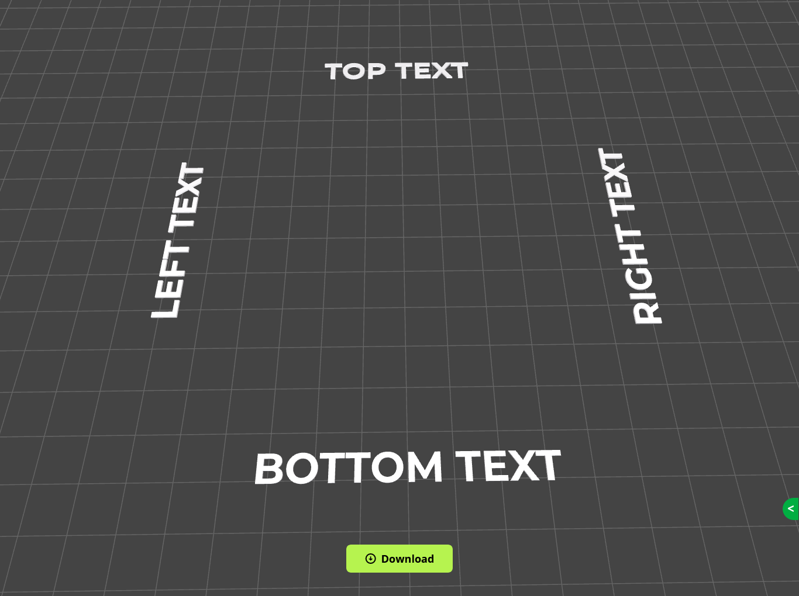
Click **Download** again and export this to a STL file and call it texts.stl.

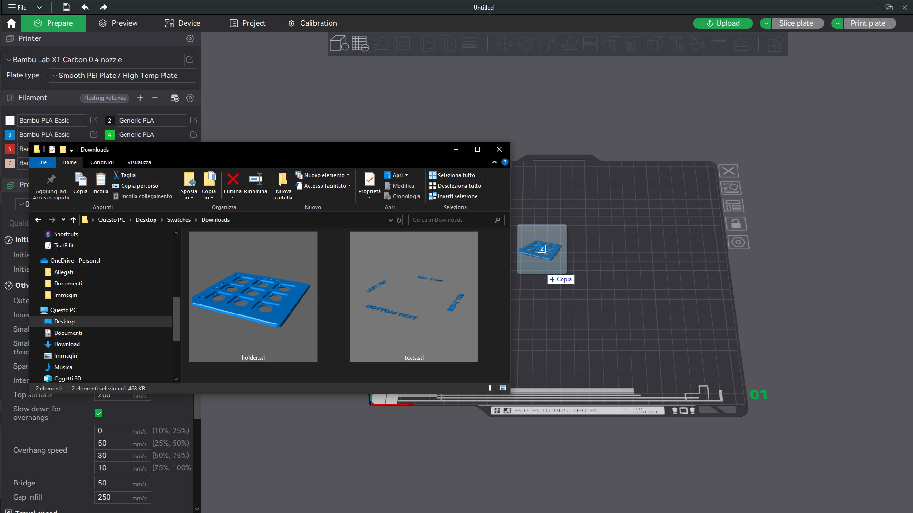
Open a new project in Bambu Studio and drag both file at the same time on it.

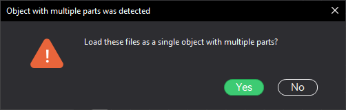

When asked if these has to be considered two parts of a single object, select **Yes**.

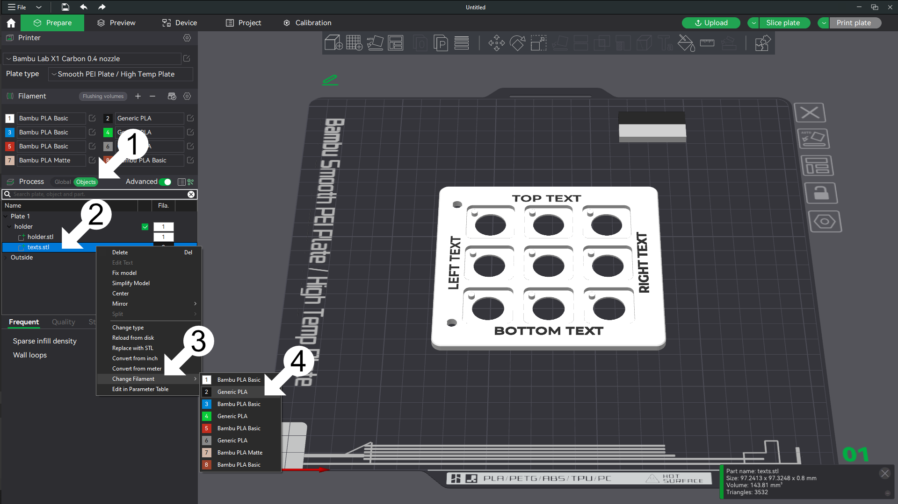
Now follow these steps:

1. Switch to the **Objects** tab by left clicking on the Global/Objects switch;
2. Right click on the texts.stl line in the objects list;
3. Move with the mouse over the **Change filament** menu item;
4. From the sub menu select the filament you want.

This procedure has been designed to work with both chiseled and extruded modes.

## Version history

| Date       | Description          |
| ---------- | -------------------- |
| 2024-06-08 | First public release |

## Thanks

Thanks to [@Stephanos](https://makerworld.com/en/@Stephanos) for the complete list of fonts and styles supported by MakerWorld he gave me access with his script **Parametric Model Maker ALL TEXT FONTS TEMPLATE** you can find [here](https://makerworld.com/en/models/484918).
